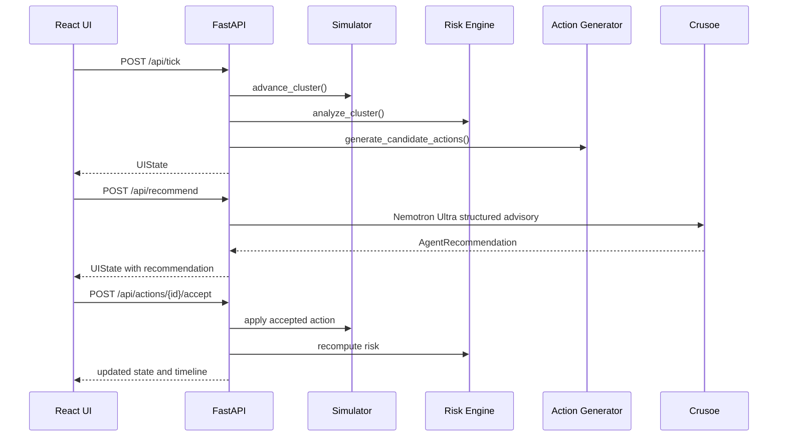

# AstroOps Live Architecture

AstroOps Live is a human-in-the-loop operations agent. The UI is not the product by itself; the product is the loop from live state to prediction to recommended action to operator decision.

## Backend Modules

- `app/models.py`: Pydantic schemas for telemetry, racks, GPUs, jobs, risks, actions, advisories, overrides, and UI state.
- `app/simulator.py`: deterministic GPU cluster simulator and scenario progression.
- `app/risk_engine.py`: Python-only scoring, slopes, ETAs, forecasts, and findings.
- `app/action_generator.py`: deterministic candidate remediation actions.
- `app/advisory_agent.py`: Crusoe structured recommendation path plus fallback.
- `app/crusoe_client.py`: exact Crusoe endpoint, model strings, and reasoning-disable flags.
- `app/action_executor.py`: applies accepted action effects to the simulation.
- `app/state.py`: in-memory runtime state.
- `app/main.py`: FastAPI endpoints and SSE.

## Frontend Modules

- `ClusterMap`: rack-level risk, thermal, power, and capacity view.
- `SituationalModel`: top findings, risk forecast, ETAs, and domain risk scores.
- `AgentRecommendation`: selected action, impact estimate, evidence, Accept, Ask Why, Override.
- `CandidateActions`: actions considered by the agent.
- `OutcomeTimeline`: accepted actions and overrides.
- `LiveFeed`: streaming telemetry feed.
- `CrusoeStatus`: real vs mock mode indicator.

## Request Flow

## Risk Engine

The LLM does not calculate slopes, ETAs, or raw scores. Python computes:

- `thermal_risk`
- `cooling_risk`
- `power_risk`
- `queue_sla_risk`
- `network_risk`
- `gpu_health_risk`
- `memory_risk`
- `storage_risk`
- `placement_risk`
- `inference_service_risk`
- `operator_policy_risk`
- `cascade_risk`

Composite risk uses weighted scoring plus a cascade bonus when multiple domains exceed 70/100.

## Crusoe Integration

Crusoe is called only for high-value reasoning moments:

- high/critical recommendation generation
- Ask Why explanation
- optional operator chat

The structured advisory path uses `nvidia/NVIDIA-Nemotron-3-Ultra-550B` with thinking disabled for Pydantic parsing. If Crusoe is unavailable, the deterministic local advisor returns a clearly marked mock/fallback advisory.
