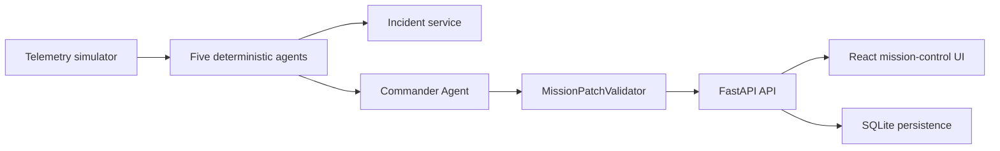

# OrbitOps

OrbitOps is a multi-agent command center for first-generation orbital GPU infrastructure. It protects long-running GPU workloads in space by monitoring workload health, thermal behavior, orbit-aware power, radiation integrity, and checkpoint/downlink recovery.

The demo is deterministic and runs locally. It does not require an external LLM API.

## What The Demo Shows

Scenario: `radiation_thermal_downlink_collision`

1. A training job starts normally on orbital GPU node `OGPU-AURORA-7`.
2. GPU and radiator temperatures rise.
3. The orbit enters a high-radiation zone and ECC corrections increase.
4. An uncorrected ECC event appears and the latest checkpoint becomes suspect.
5. A downlink window opens, but the full checkpoint is too large to transmit safely.
6. Battery margin drops during eclipse.
7. The Commander Agent proposes a human-approvable mission patch.

## 24h Accelerated Simulation

OrbitOps now runs a continuous accelerated day instead of stopping at the old T6 snapshot.

- `1 live tick = 15 simulated minutes`
- `96 ticks = 24 simulated hours`
- The UI stream advances about every 1.4 seconds, so the full day completes in a little over two minutes.
- After 24 simulated hours, the mission clock loops back to `00:00` and continues.

The simulator calculates:

- Orbit phase from a 96-minute low-Earth-orbit period.
- Solar input from the current phase: sunlight, terminator, eclipse, or high-radiation pass.
- Battery from mission reserve, daily trend, solar input, and active risk pressure.
- GPU utilization, power, GPU temperature, board temperature, and radiator temperature from workload state plus risk pressure.
- ECC/radiation indicators from deterministic radiation windows and collision peaks.
- Downlink windows every 180 simulated minutes.
- Checkpoint trust from ECC and radiation state.

The dashboard includes a `Simulation Logic` panel explaining the formulas currently applied.

## Architecture



## Agents

- Workload / GPU Agent: detects scheduler and GPU truth mismatches.
- Thermal / Physical Health Agent: detects thermal headroom and sensor divergence.
- Orbit-Aware Power Agent: balances compute, cooling, downlink, solar input, and battery.
- Radiation / Integrity Agent: reacts to ECC and radiation-risk evidence without pretending to predict exact bit flips.
- Checkpoint / Downlink / Recovery Agent: protects trusted recovery state under bandwidth and storage limits.

The Commander Agent combines high-risk findings into an ordered mission patch. The deterministic validator checks dangerous actions before execution, and human approval is required for risky recovery choices.

## Run Locally On Windows

```powershell
cd C:\Users\sivap\Documents\Codex\2026-07-05\files-mentioned-by-the-user-crusoe\outputs\astroops-live
.\start-orbitops.cmd
```

Then open:

`http://127.0.0.1:8000`

The backend serves the built React interface directly. Keep the terminal open while using the app.

If PowerShell blocks virtual environment activation, use the launcher anyway. It calls the Python executable inside `.venv` directly.

## Backend Commands

```powershell
cd C:\Users\sivap\Documents\Codex\2026-07-05\files-mentioned-by-the-user-crusoe\outputs\astroops-live\backend
.\.venv\Scripts\python.exe -m uvicorn app.main:app --reload --host 127.0.0.1 --port 8000
```

API docs:

`http://127.0.0.1:8000/docs`

## Frontend Development

```powershell
cd C:\Users\sivap\Documents\Codex\2026-07-05\files-mentioned-by-the-user-crusoe\outputs\astroops-live\frontend
npm run dev
```

Vite runs on:

`http://127.0.0.1:5173`

## Main API Endpoints

- `GET /api/telemetry/latest`
- `GET /api/telemetry/history`
- `POST /api/simulator/start`
- `POST /api/simulator/stop`
- `POST /api/simulator/reset`
- `POST /api/simulator/step`
- `GET /api/agents/findings`
- `POST /api/agents/run`
- `GET /api/incidents`
- `GET /api/patches/latest`
- `POST /api/patches/propose`
- `POST /api/patches/{patch_id}/approve`
- `POST /api/patches/{patch_id}/reject`
- `POST /api/patches/{patch_id}/execute`
- `GET /api/stream`

## Test

```powershell
cd C:\Users\sivap\Documents\Codex\2026-07-05\files-mentioned-by-the-user-crusoe\outputs\astroops-live\backend
.\.venv\Scripts\python.exe -m pytest app\tests
```

## Project Layout

```text
backend/app/
  main.py
  models.py
  database.py
  simulator/
  agents/
  validators/
  services/
  api/
  tests/
frontend/src/
  App.tsx
  api/client.ts
  components/
  types.ts
```

## Why Human Approval Exists

OrbitOps can recommend actions, rank risks, and explain tradeoffs. It should not silently trust corrupted state or execute dangerous recovery choices. Rollback, continuing after critical integrity events, and other risky patch steps must pass deterministic validation and human approval.
